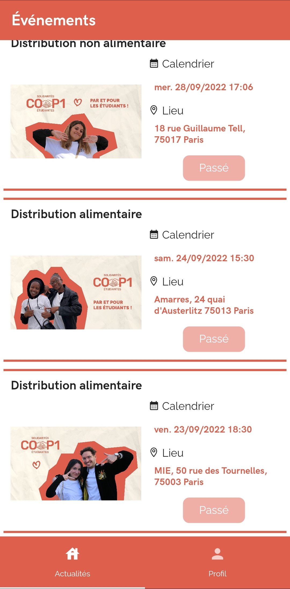
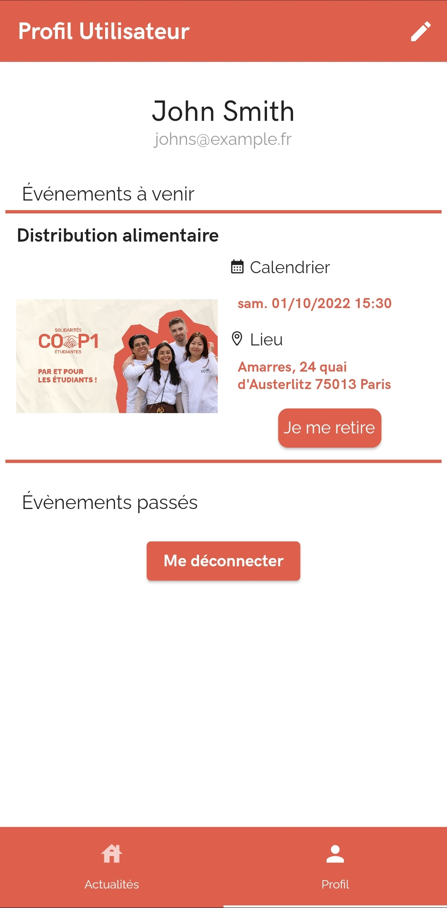
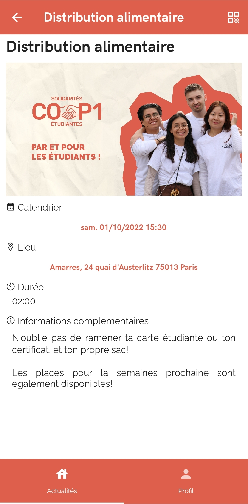
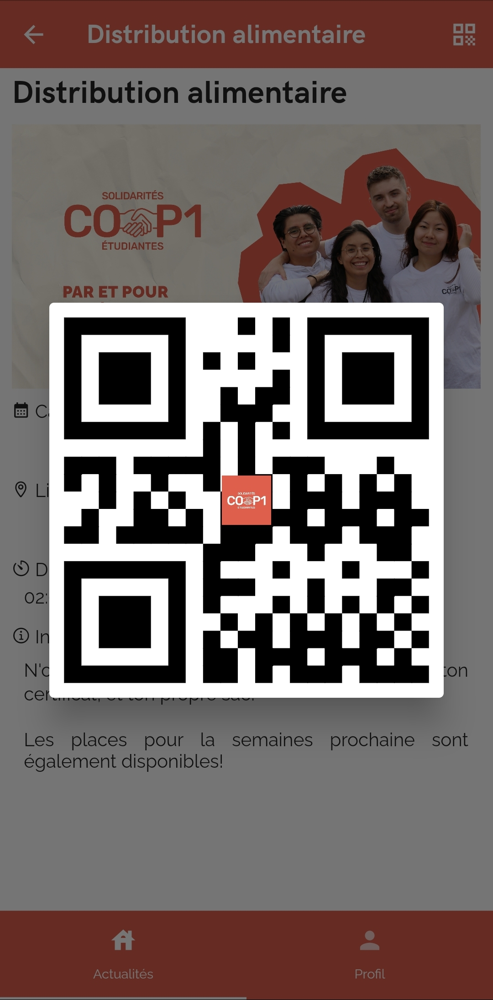

# cop1App

The application is under the `cop1/` folder and the server backend under the `back/` folder.

This application was made for a caritative association named Cop1, to better handle their events and the booking of those events.

Sadly, the association abandoned the project around the time of the delivery. The was supposed to be publicly available from the start, so here it is.

This app provides several features:

- An event tab, showing the list of available and past events organised by the association, with their time and place indicated.
<html>
    
</html>

- A profile tab for the user to see all the events they have booked
<html>
    
</html>

- An event-specific page to see all the details of the event
<html>
    
</html>

- A display of the QR-Code for the events organizers to scan when going to the event
<html>
    
</html>

- A lot of background features such as a notifications system to remind the user of the date of the event, a possibility to look for the event's place on a map and put the time of the event in the user's own agenda
